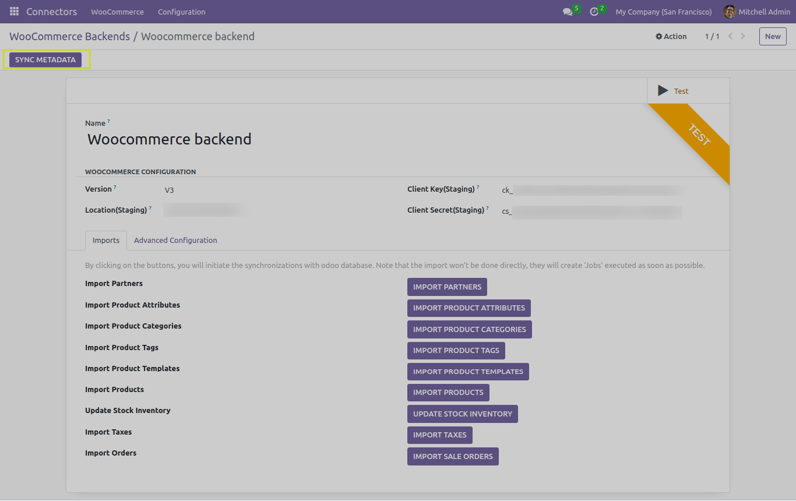
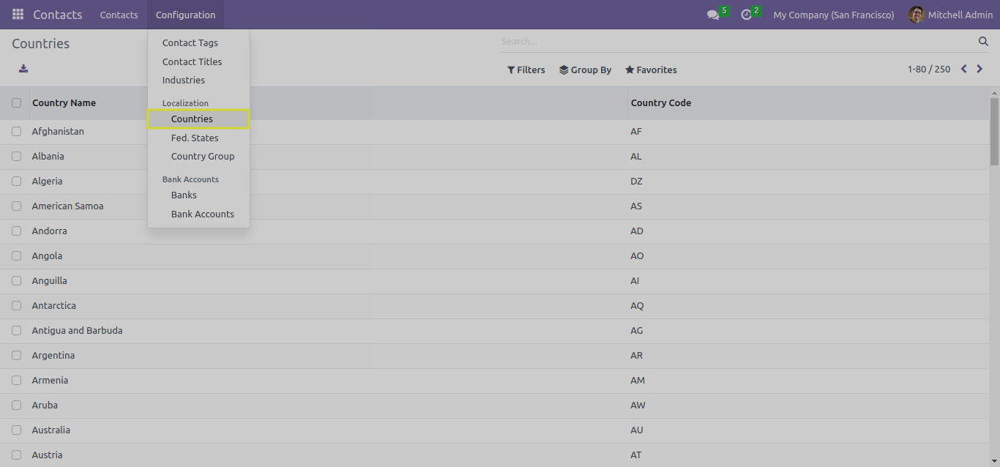
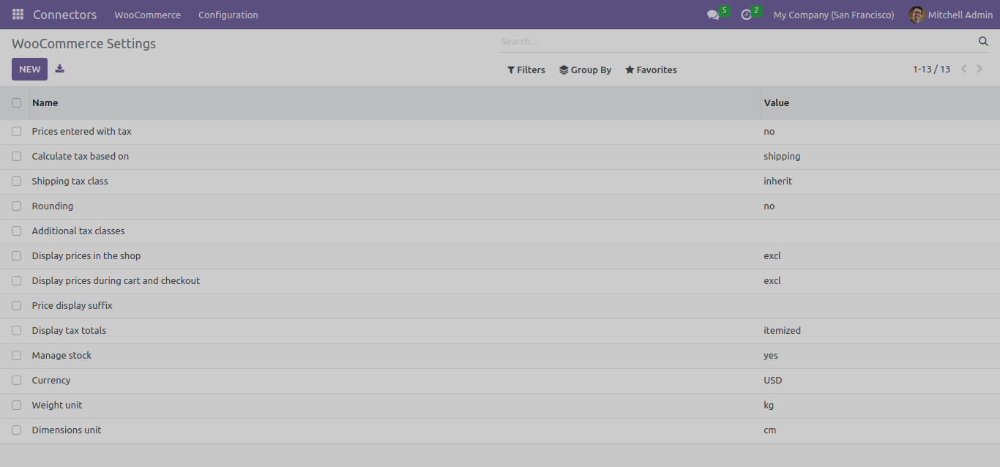
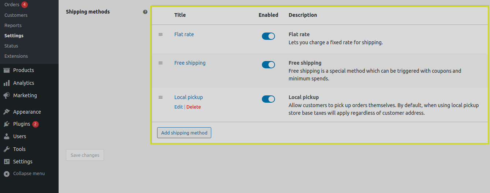
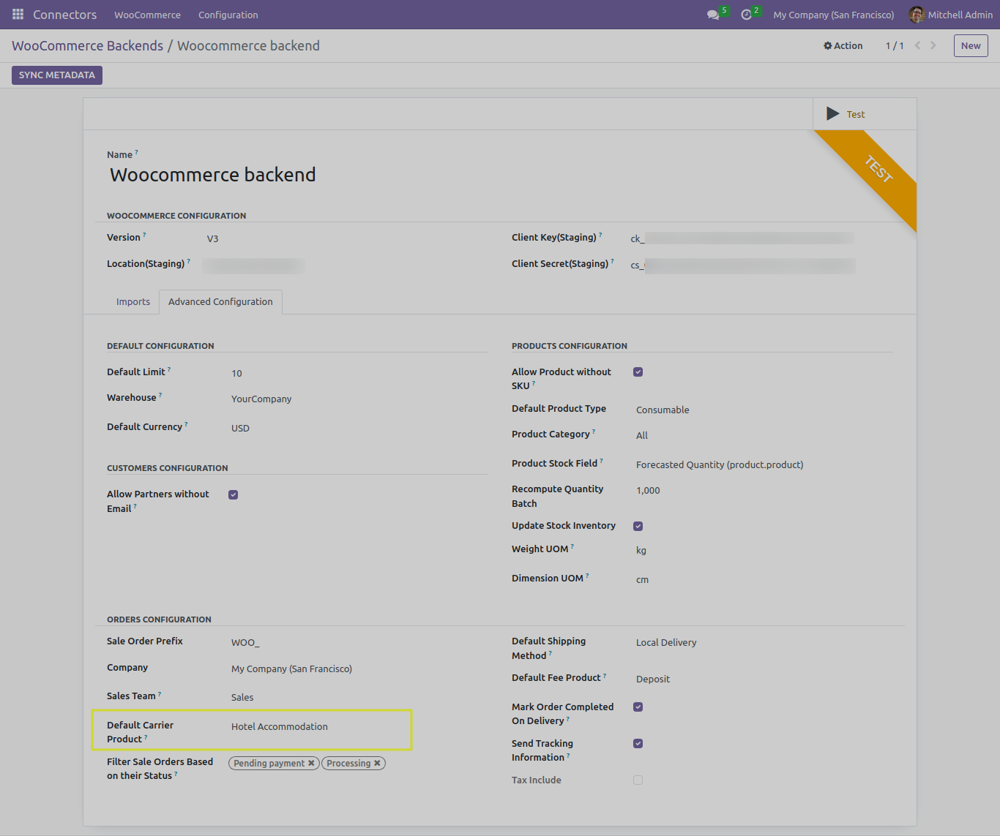
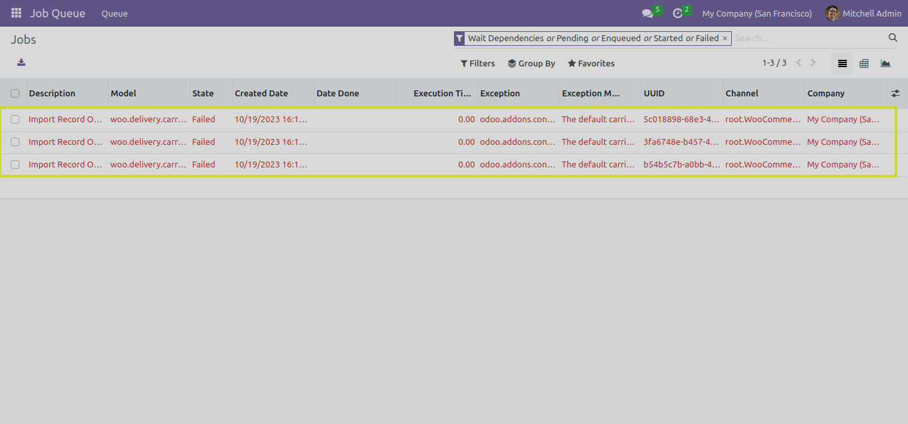
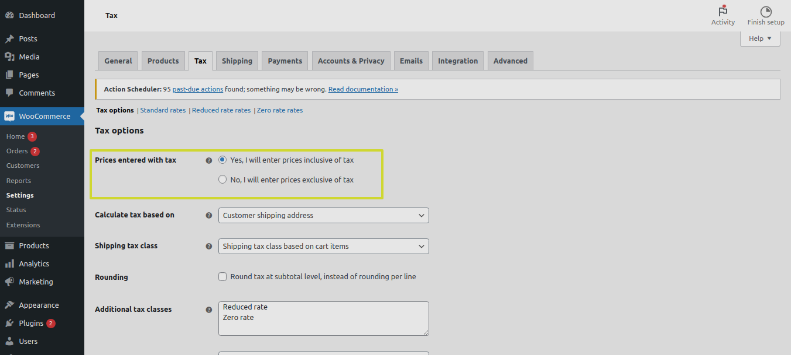
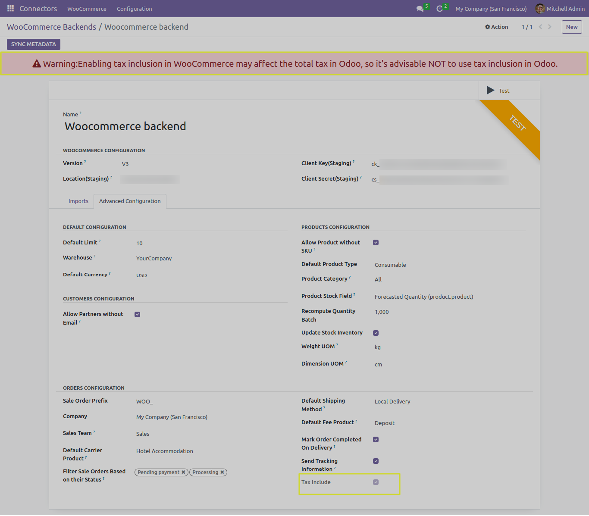
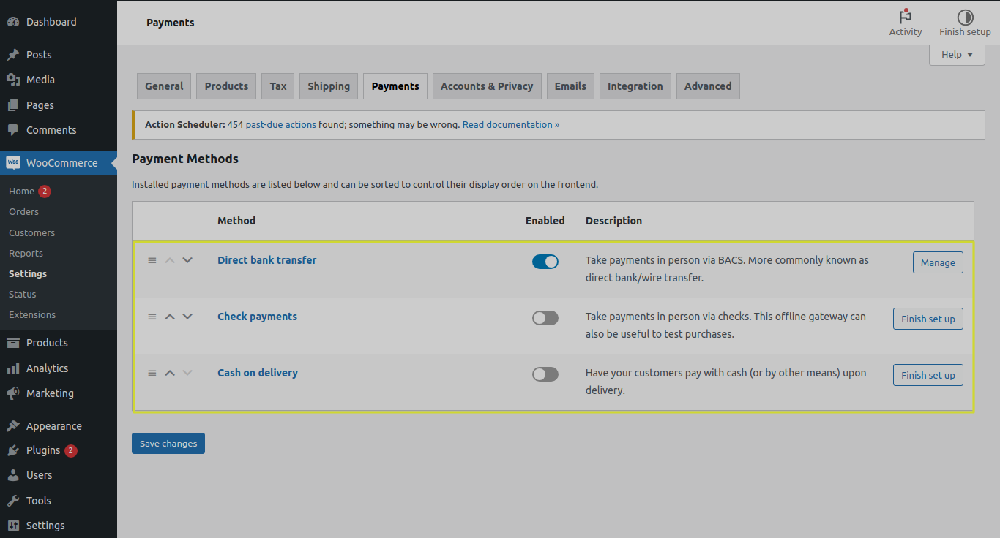
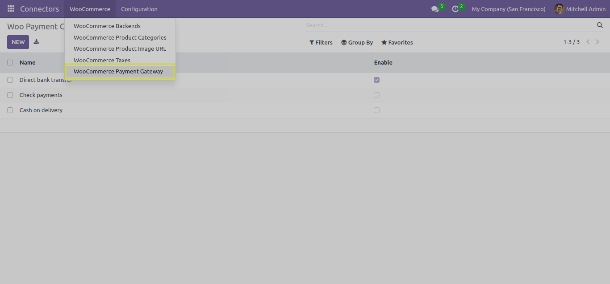

Sync MetaData
=============

In this section, we will explore the functionality of the "SYNC METADATA" button when working with the Odoo Woocommerce Connector.

Understanding the SYNC METADATA Button
---------------------------------------

The "SYNC METADATA" button is a key feature of the Odoo Woocommerce Connector, designed to simplify and streamline the synchronization of essential metadata between Odoo and WooCommerce. This functionality plays a vital role in maintaining data accuracy and consistency.

When you click the "SYNC METADATA" button, the connector performs the following actions:

1. **Importing State and Country Data**: The connector retrieves state and country information from your WooCommerce platform and ensures that this data is up-to-date in your Odoo instance. This is particularly important for order fulfillment and addressing.

2. **WooCommerce Settings**: WooCommerce platform settings and configurations are synchronized to Odoo. This includes WooCommerce-specific settings that impact the behavior of your online store. It also contains Tax policy data for accurate tax calculations in both Odoo and WooCommerce. The "SYNC METADATA" action ensures that tax policies are synchronized and consistent across platforms.

It also constaint below settings information.

1. Weight Unit and Dimension Unit.
2. Default currency.
3. Stock Management settings.

* We can find the imported Woocommerce Settings list from "WooCommerce Settings" menu.

3. **Importing Shipping Methods**: Shipping methods are crucial for order processing and shipping cost calculations. The connector imports shipping methods from WooCommerce to Odoo, enabling a seamless order fulfillment process.

* We need to select the Default Carrier Product from advance configuration of Woocommerce backend to use it when syncing metadata for importing shipping methods.

.. image:: _static/woo_shipping_method.png
   :align: center
   :alt: Backend View

* If Default carrier is not selected the shipping methods will not be import successfully.

4. **Tax Settings and Policy**: By default the tax price is exclusive in Woocommerce but when the tax inclusion in Woocommerce settings is set to YES, it may affect the odoo's total tax calculation. In order to make it flaw less the warning message will be visible in Woocommerce backend to notify the user.

5. **Payment Gateways**: We can also Import all the payment gateways information available in woocommerce.

By using the "SYNC METADATA" button, you can maintain data integrity and consistency between your Odoo instance and WooCommerce platform. This ensures that critical informations are accurate and up-to-date.

Next Steps
----------

In the upcoming sections, we will provide detailed instructions on how to use the "IMPORT PARTNERS" button and it's advance configuration settings.
