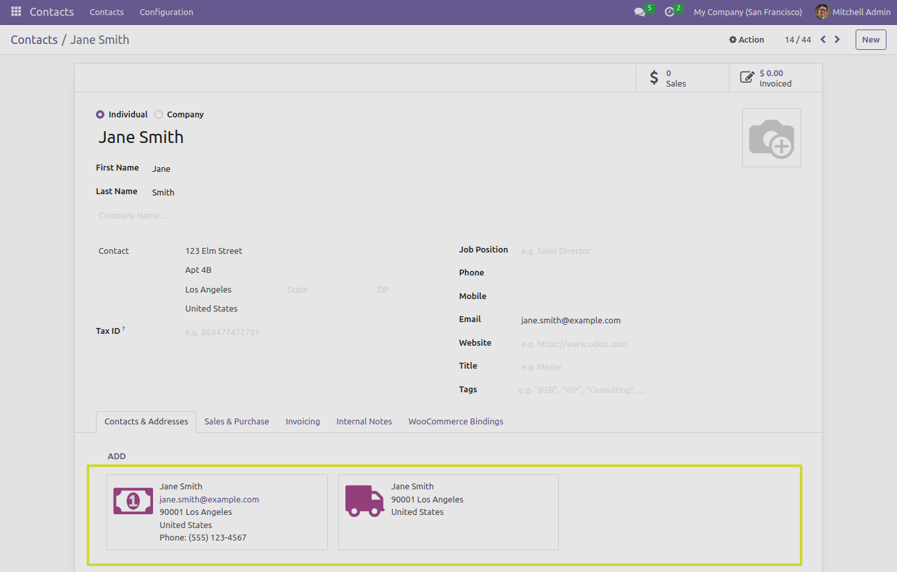
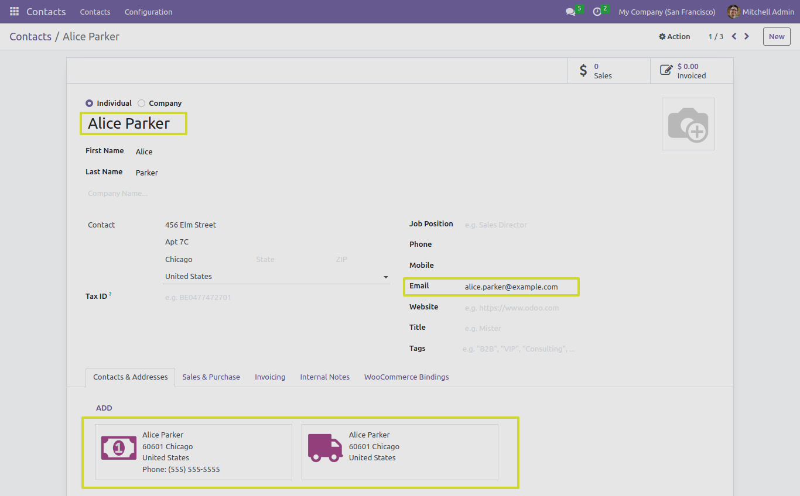

Partner Management
==================

In this section, we will explore the functionality of the "IMPORT PARTNERS" button and it's different test cases when working with the Odoo Woocommerce Connector.

.. image:: _static/woo_import_partner_button.png
   :align: center

Customer Import
---------------

- When you click the "IMPORT PARTNERS" button, the connector performs the action of importing customers from woocommerce to odoo instace.
- There are different cases which could be possible while performing this operation.

Case 1: Create Customer with Main Customer, Billing, and Shipping
*****************************************************************

In this scenario, we will import a customer record that includes the main customer, billing customer, and shipping customer details. This comprehensive approach ensures that all relevant information is captured.

Case 2: Create Customer with Main Customer and Billing Customer
***************************************************************

This test case focuses on creating a customer record with the main customer and billing customer details.

.. image:: _static/partner_main_billing.png
   :align: center

Case 3: Create Customer with Main Customer and Shipping Customer
****************************************************************

In this scenario, we create a customer record that includes the main customer and shipping customer details.

.. image:: _static/partner_main_shipping.png
   :align: center

Case 4: Create Customer with Main Customer and Only Set Email
*************************************************************

In this case, we create a customer record with the main customer and set only the email address.

Case 5: Create Customer with Main Customer and Set Email and First Name
***********************************************************************

Here, we create a customer record with the main customer, providing both the email address and the customer's first name.

Case 6: Create Customer with Main Customer and Set Email and Last Name
**********************************************************************

Similar to the previous case, we create a customer record with the main customer, including the email address and the customer's last name.

.. image:: _static/partner_mail_last_billing_shipping.png
   :align: center

Case 7: Create Customer with Main Customer and Set Email, First Name, and Last Name
***********************************************************************************

This scenario involves creating a customer record with the main customer and including the email address, first name, and last name.

Case 8: Create Customer with Main Customer and Set Email and Username
*********************************************************************

In this test case, we create a customer record with the main customer and set both the email address and a unique username for customer identification.

.. image:: _static/partner_mail_user_billing_shipping.png
   :align: center

Case 9: Main Case for Backend Boolean Field 'Allow Partner Without Email' at Advance Configuration Tab
******************************************************************************************************
This main test case explores the behavior of the backend Boolean field 'Allow Partner Without Email' located in the Advance Configuration tab. It's essential for understanding how the connector handles cases where email information is not available.

* **If Allow Partner Without Email is False** : It will raise mapping error and record of customer will be not imported successfully.

.. image:: _static/queue_job_fail_partner.png
   :align: center

* **If Allow Partner Without Email is True** : It will import customer record successfully.

Next Steps
----------

In the upcoming sections, we will provide detailed instructions on how to use the "IMPORT PRODUCT ATTRIBUTES" button and it's advance configuration settings.
