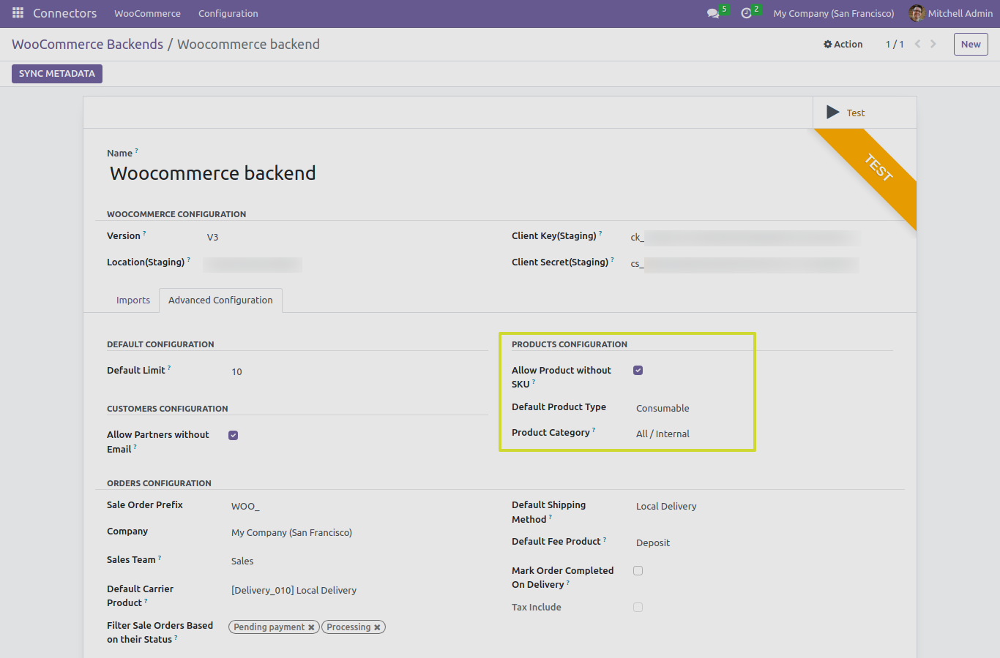

Product
=======

In this section, we will explore the functionality of the "IMPORT PRODUCTS" button and its different test cases with advanced functionality when working with the Odoo Woocommerce Connector.

Advance Configurations of Product
---------------------------------

There are several advanced functionalities when we are using "IMPORT PRODUCTS" button:

1. **Importing Products Without SKUs**: The connector can handle product imports even when WooCommerce products lack SKUs. It ensures that products without SKUs are integrated effectively.

* If "Importing Products Without SKUs" boolean is False it will not import Woocommerce products that doesn't consist SKU.

2. **Setting Default Product Type**: You can define a default product type for imported products. This saves time by automatically categorizing new products into the specified product type.

3. **Setting Default Product Category**: Similarly, At the time of importing products if there is no link found between Odoo category and Woocommerce category you can set a default product category for imported products.

4. **Import From Date Functionality**: The connector allows you to specify an import-from date. This ensures that only products created or modified after the specified date are imported into Odoo.

The "IMPORT PRODUCTS" Button
----------------------------

The "IMPORT PRODUCTS" button plays a pivotal role in the Odoo Woocommerce Connector. When you click this button, the connector performs the following actions:

1. **Importing Products**: The primary function of the "IMPORT PRODUCTS" button is to import products from WooCommerce into your Odoo instance. This allows you to manage your entire product catalog seamlessly.

2. **Adding Tags & Matching Woo Category with Product Category**: The connector not only imports products but also associates tags with them, providing a rich, organized product catalog. Furthermore, if a product’s category in WooCommerce matches an existing product category in Odoo, the connector will link them together, ensuring that imported products are correctly categorized in Odoo.

3. **Setting Product Images**: The connector allows you to set images for imported products, making your product catalog visually appealing.

4. **Storing Image URLs of Product Gallery**: In addition to setting images, the connector stores the URLs of images associated with a product's image gallery. This allows you to access and display product images from your WooCommerce store in your Odoo instance.

5. **Auto Import Product Attributes and Values**: Any product attributes and their values created specifically for a product in WooCommerce will be automatically imported into Odoo.

Note
****

* While importing product directly for the first time user will get "Mapping Message" in queue job and asked to import attribute first in order to link Environment level attribute with Products.

Next Step
---------

In the upcoming sections, we will talk about "IMPORT TAXES" functionality.
