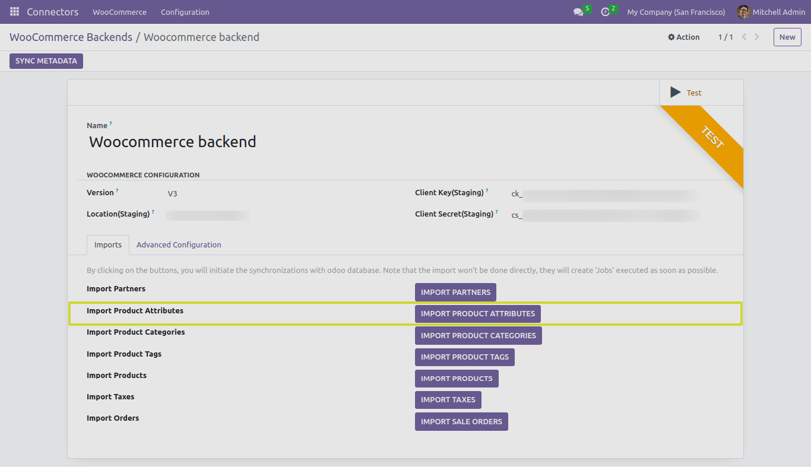
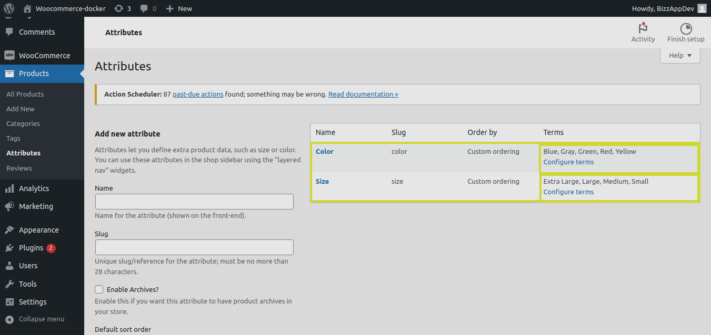
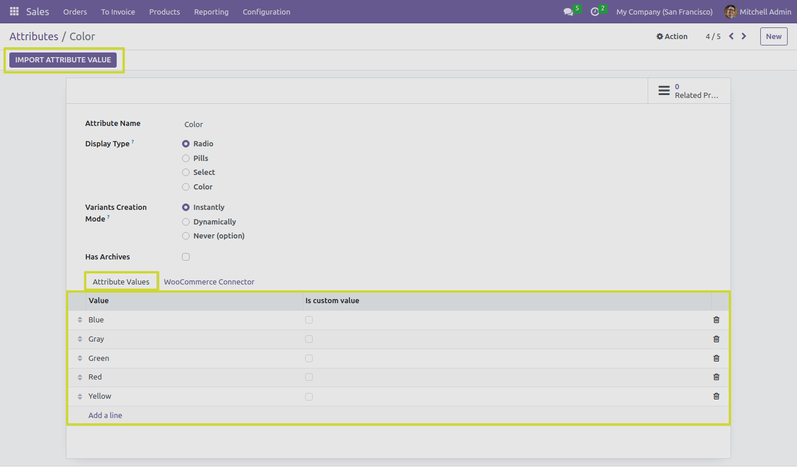
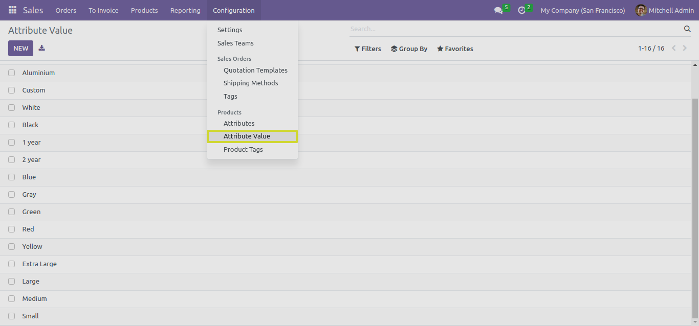

Product Attributes
==================

In this section, we will explore the functionality of the "IMPORT PRODUCT ATTRIBUTES" button and its different test cases when working with the Odoo Woocommerce Connector.

The "IMPORT PRODUCT ATTRIBUTES" Button
---------------------------------------

By clicking on "IMPORT PRODUCT ATTRIBUTES" button, We can import all the Attributes and it's Values which are created on Woocommerce environment level.

* When you click the "IMPORT PRODUCT ATTRIBUTES" button, the connector performs the following actions:

1. **Importing Product Attributes**: Product attributes define the characteristics and variations of your products, such as size, color, or material. The connector imports product attributes from WooCommerce to Odoo, ensuring consistency in product catalog management.

2. **Importing Attribute Values**: Product attributes often have values associated with them, representing the options available for customers. These attribute values are also imported to Odoo, enabling precise product information synchronization.

* There is a button called "IMPORT ATTRIBUTE VALUES" which eventually helps to import or update the specific attribute's values.

* We can also find the imported attribute values list from "Attribute Value" menu.

**Note**: In WooCommerce, Product Attributes and Values can be defined in two ways:

1. **Environment-Level Attributes**: Attributes and their associated values can be created at the WooCommerce environment level, making them available for use by all products. This approach is suitable for attributes that apply to a wide range of products in your store.

2. **Product-Specific Attributes**: Alternatively, attributes and values can be created at the product level, allowing you to define attributes that are specific to individual products. This approach is ideal when certain products have unique attribute requirements that differ from the general product catalog.

Next Steps
----------

In the upcoming sections, we will delve into each of the test cases related to importing product tags, providing detailed instructions and insights.
