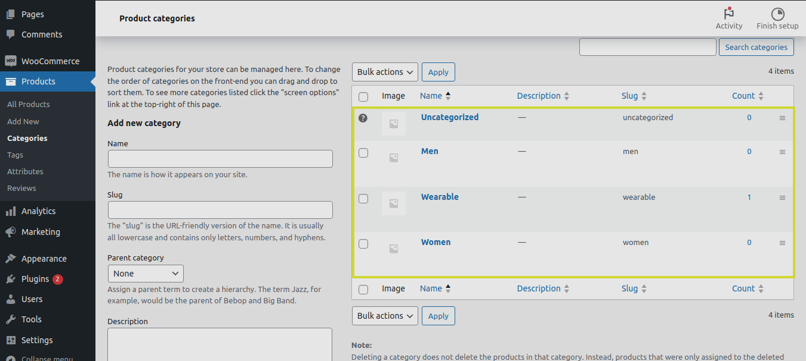
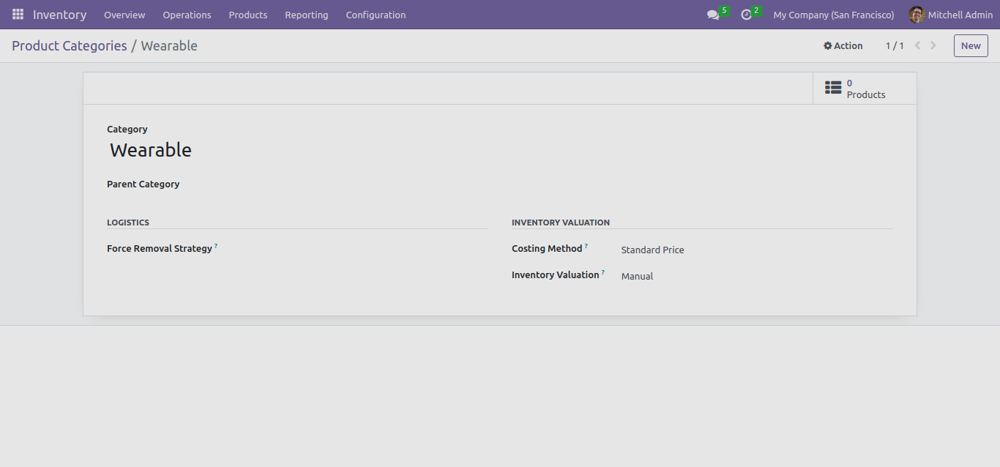
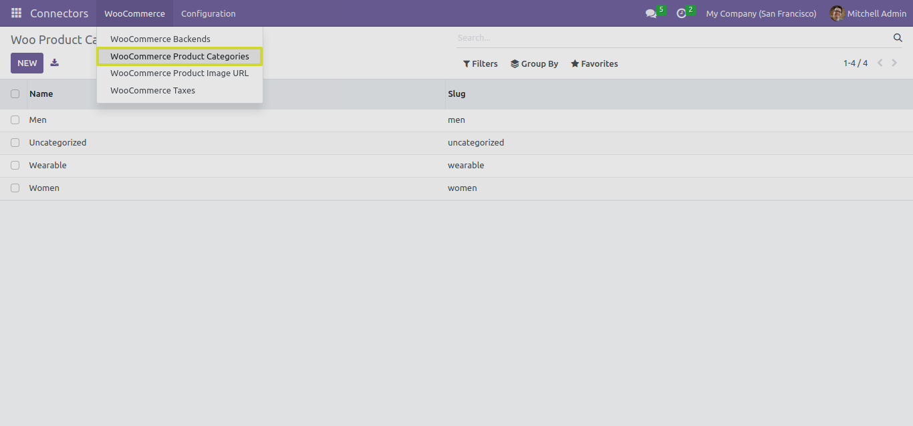
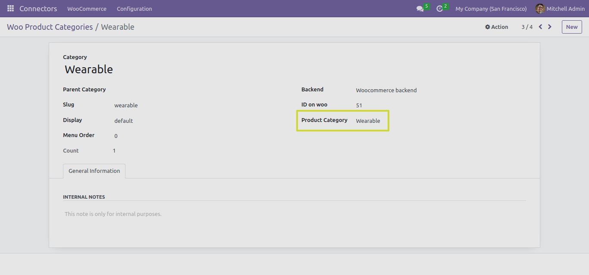

Product Categories
==================

In this section, we will explore the functionality of the "IMPORT PRODUCT CATEGORIES" button and its different test cases when working with the Odoo Woocommerce Connector.

.. image:: _static/woo_category_button.png
   :align: center

The "IMPORT PRODUCT CATEGORIES" Button
---------------------------------------

The "IMPORT PRODUCT CATEGORIES" button is a key feature of the Odoo Woocommerce Connector, designed to simplify and streamline the synchronization of product categories between Odoo and WooCommerce.

By clicking the "IMPORT PRODUCT CATEGORIES" button, you can perform the following actions:

1. **Importing Product Categories**: Product categories help organize and categorize your products, making it easier for customers to browse and find what they need. The connector imports product categories from WooCommerce to Odoo, ensuring consistency in product catalog management.

Linking Existing and Imported Categories
----------------------------------------

A powerful feature of the Odoo Woocommerce Connector is its ability to link existing Odoo product categories with WooCommerce-imported categories. This feature is particularly useful when you already have product categories set up in your Odoo instance, and you want to match them with the categories imported from WooCommerce.

Here's how it works:

1. When you click the "IMPORT PRODUCT CATEGORIES" button, the connector imports product categories from WooCommerce.

2. The connector checks if there are existing categories in your Odoo instance with the same names as the imported categories.

* We can find the imported Woocommerce Product Categories list from "WooCommerce Product Categories" menu.

3. If a matching category is found, the connector links the existing Odoo category with the WooCommerce-imported category. This linkage ensures that your product catalog remains organized and structured as per your preferences.

Note
****

* After completion of importing process the User can also manually link similar product category and with woocommerce category.

* This feature saves you time and effort by avoiding the need to manually organize and categorize products in your catalog if similar categories already exist in your Odoo instance.

Next Steps
----------

In the upcoming sections, we will delve into each of the test cases related to importing product tags, providing detailed instructions and insights.
