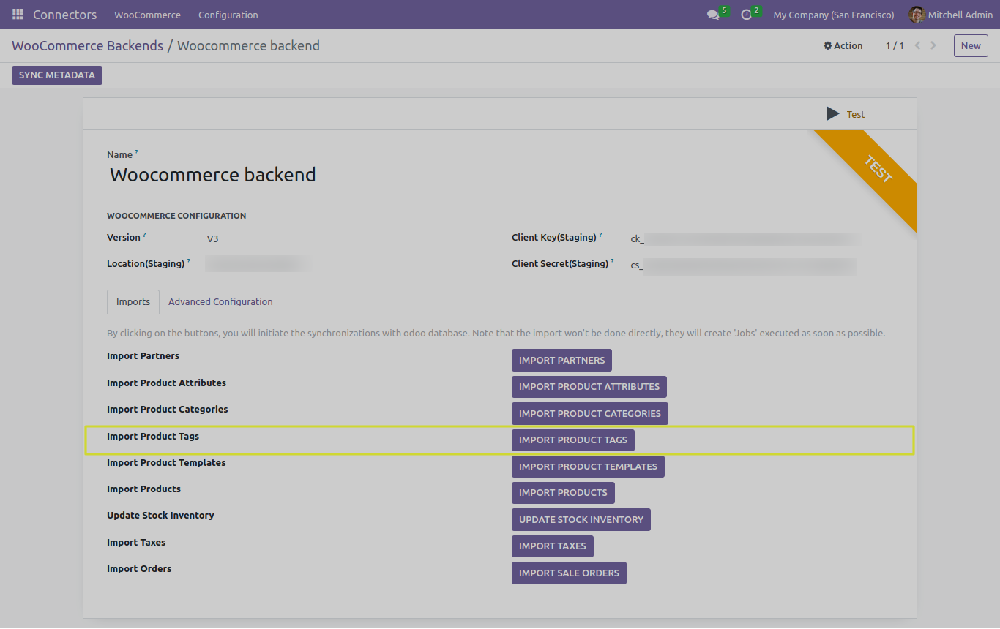
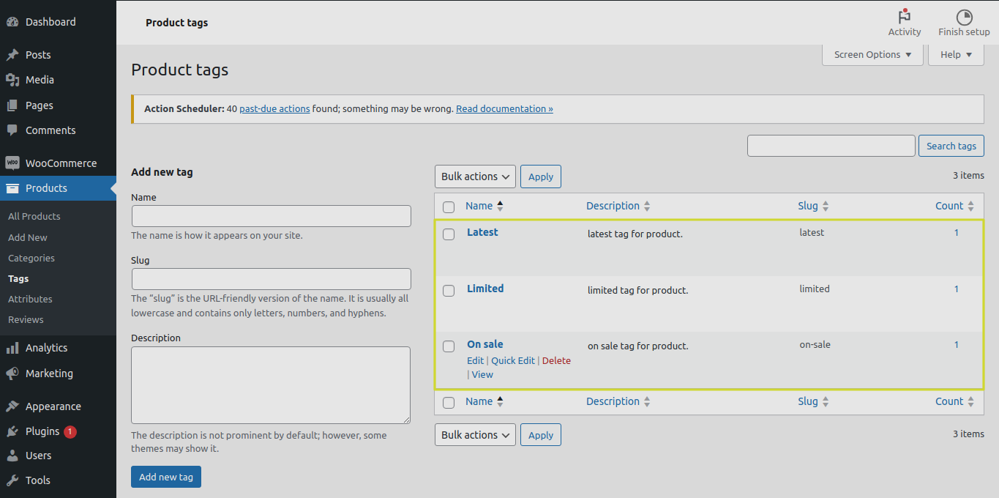
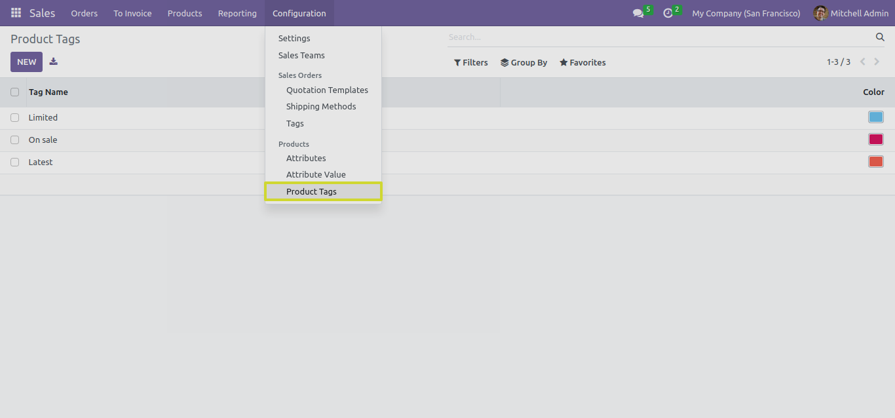

Product Tags
============

In this section, we will explore the functionality of the "IMPORT PRODUCT TAGS" button and its different test cases when working with the Odoo Woocommerce Connector.

The "IMPORT PRODUCT TAGS" Button
--------------------------------

The "IMPORT PRODUCT TAGS" button serves a crucial role in the Odoo Woocommerce Connector. When you click this button, the connector performs the following actions:

1. **Importing Product Tags**: Product tags are essential for categorizing and organizing your products, providing a structured browsing experience for customers. The connector imports product tags from WooCommerce to Odoo, ensuring consistency in product catalog management.

* We can find the imported Woocommerce Product Tags list from "Product Tags" menu.

**Note**: If a product tag with the same name already exists in Odoo, the connector will not create a duplicate. Instead, it will link the product to the existing tag, ensuring efficient tag management and preventing duplication.

Next Steps
----------

In the upcoming sections, we will explore different test cases related to importing product templates and provide detailed instructions for configuring your connector to meet your specific business needs.
