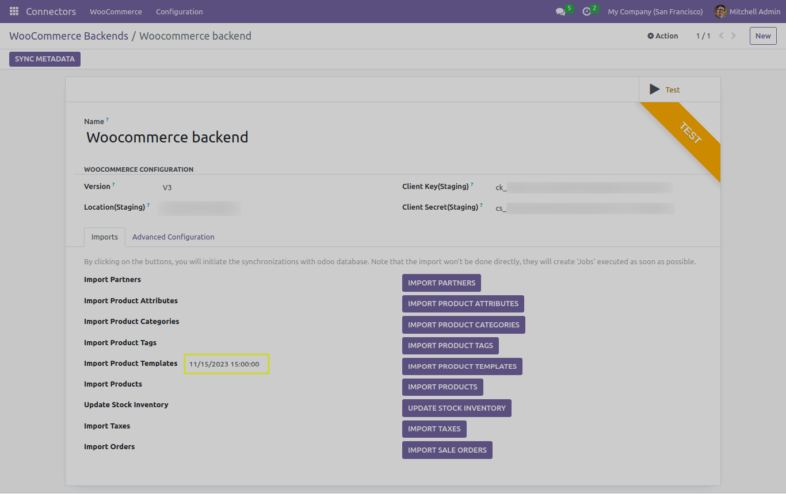
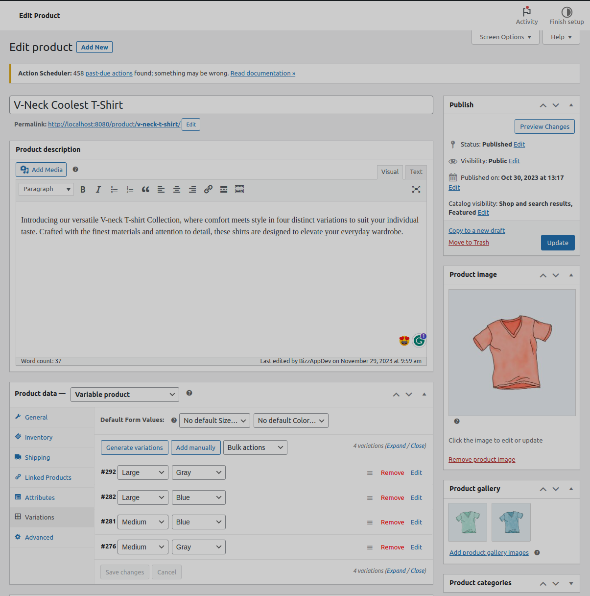
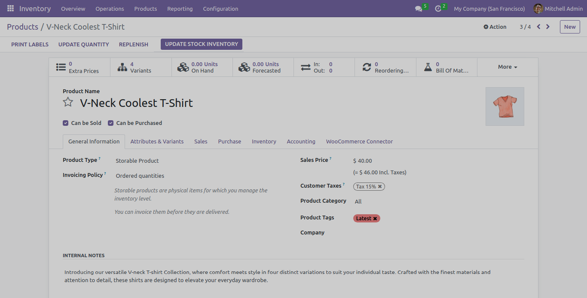
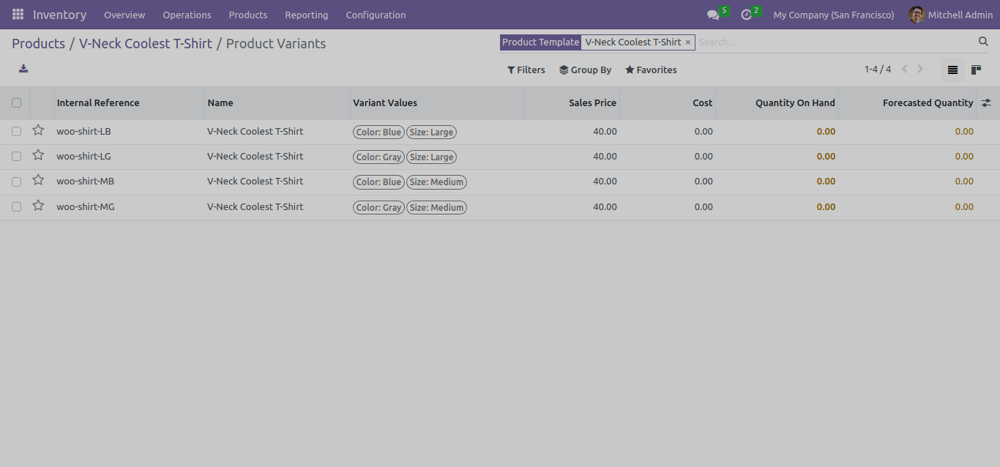

Product Templates
=================

In this section, we will explore the functionality of the "IMPORT PRODUCT TEMPLATES" button and understand how to import variable type products from woocommerce .

- **Import From Date Functionality**: The connector allows you to specify an import-from date. This ensures that only variable type products created or modified after the specified date are imported into Odoo.

The "IMPORT PRODUCT TEMPLATES" Button
-------------------------------------

The example of variable type product and it's different variations in woocommerce is given below.

- Variations are created by the attribute and it's values defined in woocommerce product's attributes tab.

- Here, we can observe that the variable type product in woocommerce is imported as a Product Template and it also contains all it's Variations.

Custom Defined Variations Scenario
----------------------------------

It could be possible that

Advance Configurations of Product Template
------------------------------------------

- It provides almost all the advance configurations settings which is given by Product Import functionality.
- We will cover all these settings at the time of understanding "IMPORT PRODUCTS" functionality.

Next Step
---------

In the upcoming sections, we will talk about "IMPORT PRODUCTS" functionality.
