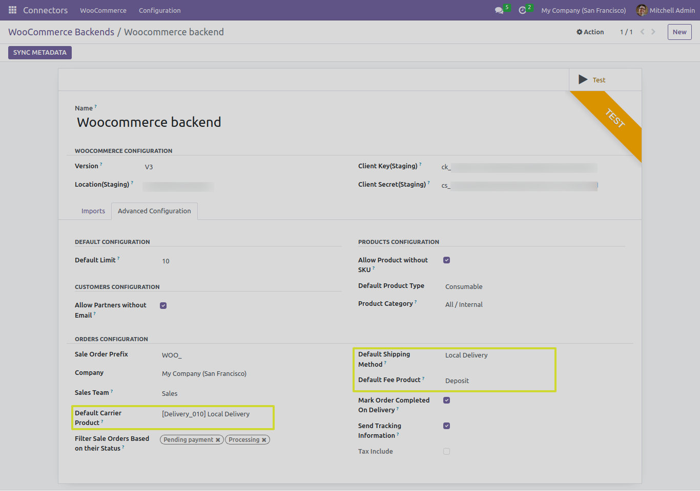

Sale Order
==========

In this section, we will explore the functionality of the "IMPORT SALE ORDERS" button and its advance configurations with different test cases when working with the Odoo Woocommerce Connector.

.. image:: _static/ import_sale_order_button.png
   :align: center

**Import From Date Functionality**: The connector allows you to specify an import-from date. This ensures that only products created or modified after the specified date are imported into Odoo.

.. image:: _static/ sale_import_from_date.png
   :align: center

The "IMPORT SALE ORDERS" Button
-------------------------------

- The "IMPORT SALE ORDERS" button serves a crucial role in the Odoo Woocommerce Connector.
- There are different cases which could be possible while performing this operation.

Case 1: Import Sale Order with basic configuration
**************************************************

In this scenario, we will understand some of the advance configuration usage.

1. **Sale Order Prefix**: To differentiate between Woocommerce orders and odoo's own sale orders we define some value in this field.

2. **Company**: Company is one of the required field which allow user to import woocommerce orders for sigle company in multi company environment.

3. **Sales Team**: We can also set the default Sales team in all the sale orders which are imported from the Woocommerce.

4. **Filter Sale order based on status**: We can filter out the Woocommerce orders and import only that orders which are currently in particular stage.

* We can find the pre-defined list of sale status from "WooCommerce Sale Status" menu.

Case 2: Import Sale Order without shipping methods and avoiding recalculate action(taxable product)
***************************************************************************************************

In this scenario, we will import a simple order record that include product without any shipping methods and also skip "recalculate" action and see the import proccess.

Case 3: Import Sale Order without shipping methods and performing recalculate action(taxable product)
*****************************************************************************************************

In this scenario, we will import a simple order record that include product without any shipping methods and also perform "recalculate" action and see the import proccess.

Here we can see two warning banners which represents the following things:

* The tax that applied on taxable product didn't match with total tax of odoo.
* The total amount of order doesn't equals to total amount in odoo's sale order.

**Note**: We can handle this situation by properly configuring tax in woocommerce and odoo.

Case 4: Import Sale Order with shipping methods and fees and coupons
********************************************************************

In this scenario, we will import a Woocommerce order record that include shipping methods, Fees and Coupons and also understand regarding advance configuration and see the import proccess.

**Note**: We need to set the advance configurations of sale order that contains various informations such as:

* N/A type of Shipping method selected in sale order.
* Fees added in sale order.
* Other pre-defined shipping method.

**Default Shipping Method**: We need to select Default shipping method for that type of shipping method which is defined at the time of creating the Woocommerce Order.

* If Default Shipping Method is not set.

**Default Carrier Product**: At the time of importing orders if shipping method is not imported yet then we will import it first and set the Default Carrier Product in it.

* If Default Carrier Product is not set.

**Default Fee Product**: For Woocommerce orders which contains fees, we need to select the Default Fee Product to manage order accurately in odoo.

* If Default Fee is not set.

**Note**: Warning banners are visible as Woocommerce also counts tax on shipping or fees.

.. image:: _static/sale_order_shipping_fee.png
   :align: center

* Here, we can see applied coupons on order.
* The shipping and fees applied on this order can also be visible.

Next Steps
----------

In the upcoming sections, we will explore the Export Sale Order Status and Tracking Reference functionality.
