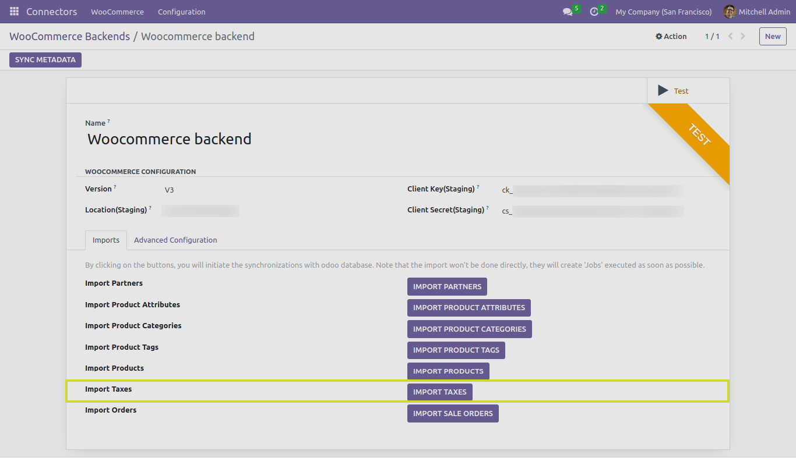
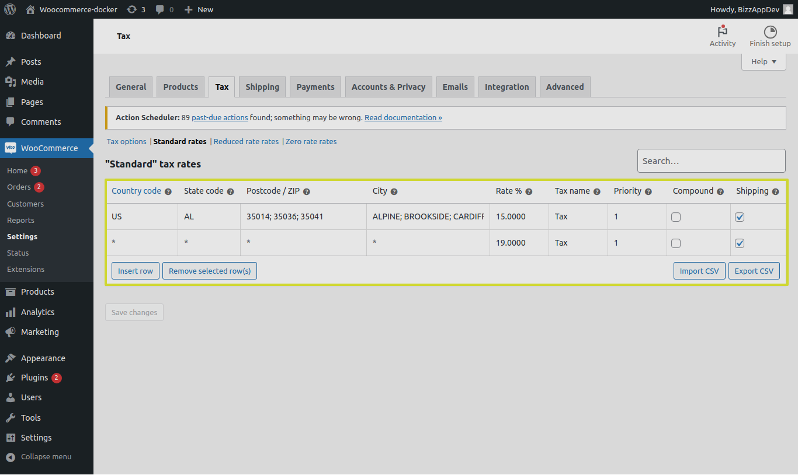
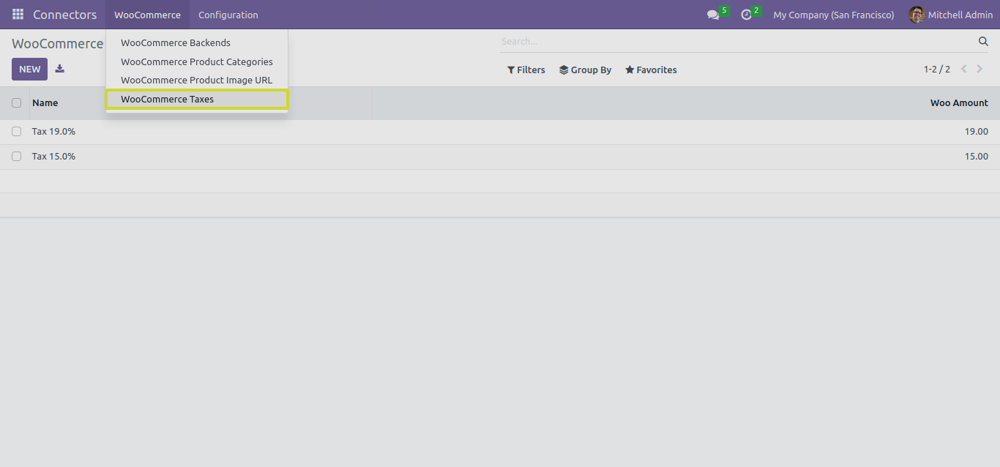
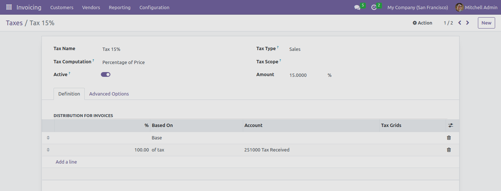
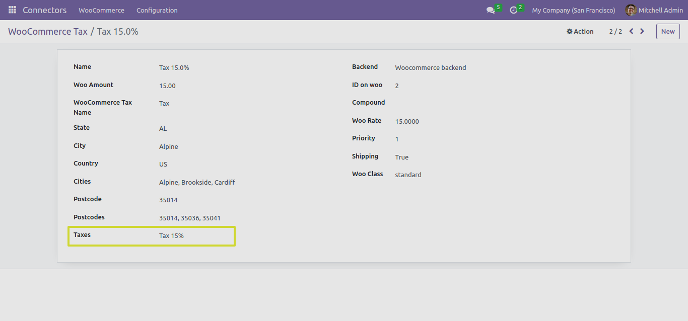

TAX
===

In this section, we will explore the functionality of the "IMPORT TAXES" button and its different test cases when working with the Odoo Woocommerce Connector.

The "IMPORT TAXES" Button
-------------------------

The "IMPORT TAXES" button serves a crucial role in the Odoo Woocommerce Connector. When you click this button, the connector performs the following actions:

1. **Importing Taxes**: Taxes are essential for any successful product management as well as order management.

* We can find the imported Woocommerce Taxes list from "WooCommerce Taxes" menu.

**Note**: If a co-responding Tax already exists in Odoo, the connector will link Woocommerce tax to the existing odoo tax.

Next Steps
----------

In the upcoming sections, we will explore different test cases related to importing sale orders.
