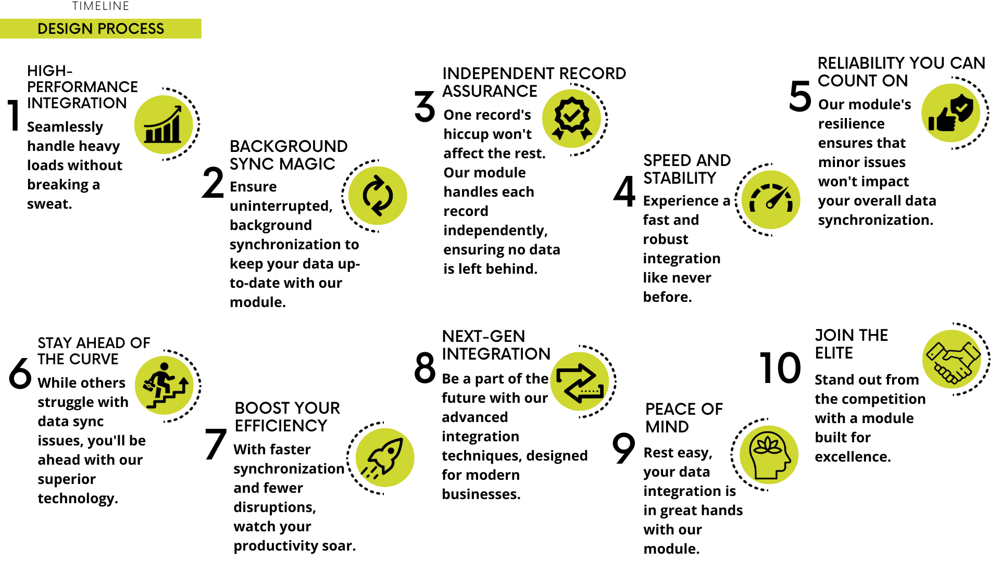

Connector Woocommerce
=====================

Description
-----------

The Odoo-WooCommerce connector is a software integration solution that connects two popular business platforms: Odoo, an open-source enterprise resource planning (ERP) and customer relationship management (CRM) system, and WooCommerce, a widely used e-commerce platform for WordPress. This connector enables seamless data synchronization and communication between these two systems, allowing businesses to efficiently manage their e-commerce operations, sales, inventory, and customer data.

Key Features
------------

- **High-Performance Integration**: Seamlessly handle heavy loads without breaking a sweat.
- **Background Sync Magic**: Keep your data up-to-date without any interruptions, as our module synchronizes everything in the background.
- **Independent Record Assurance**: A hiccup with one record won't hold back the rest. Our module ensures that each record is treated independently, ensuring no data is left behind.
- **Speed and Stability**: Experience a fast and robust integration like never before.
- **Reliability You Can Count On**: Our module's resilience ensures that minor issues won't impact your overall data synchronization.
- **Stay Ahead of the Curve**: While others struggle with data sync issues, you'll be ahead with our superior technology.
- **Boost Your Efficiency**: With faster synchronization and fewer disruptions, watch your productivity soar.
- **Next-Gen Integration**: Be a part of the future with our advanced integration techniques, designed for modern businesses.
- **Peace of Mind**: With our module, you can rest easy knowing that your data integration is in the best hands.
- **Join the Elite**: Stand out from the competition with a module that's built for excellence.

Author
------

- BizzAppDev

Installation
------------

Under applications, the application `bad_connector_woocommerce` can be installed/uninstalled.

Known issues/Roadmap
---------------------

- #N/A

Changelog
---------

- #N/A
