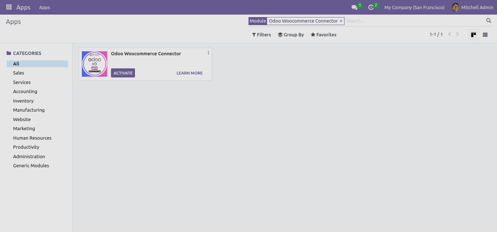
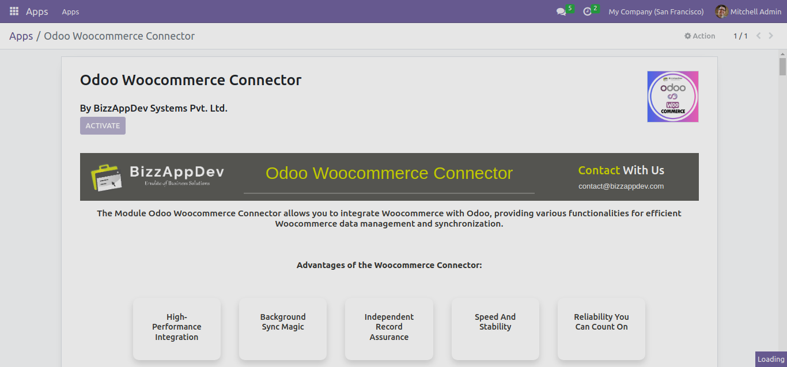

Installation
============

In this section, we provide step-by-step instructions on how to install the Odoo Woocommerce Connector app in your Odoo instance.

Prerequisites
-------------

Before you begin the installation process, make sure you have the following prerequisites in place:

1. **Odoo Instance**: You should have access to an Odoo instance where you want to install the connector.

2. **Admin Credentials**: You need administrative credentials to install apps in Odoo.

3. **Internet Connection**: Ensure that your Odoo instance has an active internet connection for app installation.

Installation Steps
------------------

Follow these steps to install the Odoo Woocommerce Connector app:

1. **Access your Odoo instance**: Log in to your Odoo instance using your admin credentials.

2. **Navigate to the Apps Module**: From the Odoo dashboard, go to the "Apps" module.

3. **Search for the Connector**: In the "Apps" module, use the search bar to look for the "Odoo Woocommerce Connector."

4. **Install the App**: When you find the connector app, click on it to view the details. Then, click the "Activate" button to start the installation process.

5. **Wait for Installation**: Odoo will install the app. This process may take a few moments, depending on your device speed.

That's it! The Odoo Woocommerce Connector app is now installed in your Odoo instance and ready for configuration and use.

Next Steps
----------

After installing, you can proceed to the "Backend Overview" section of this documentation to get the basic idea about connector backend it's configuration.

